[Home](https://mgcodesandstats.github.io/) |
[Time Series Consulting](https://mgcodesandstats.github.io/timeseriesconsulting/) |
[Portfolio](https://mgcodesandstats.github.io/portfolio/) |
[Terms and Conditions](https://mgcodesandstats.github.io/terms/) |
[E-mail me](mailto:michael@michaeljgrogan.com)

ARIMA (Autoregressive Integrated Moving Average) is a major tool used in time series analysis to attempt to forecast future values of a variable based on its present value. For this particular example, a monthly weather dataset from 1941 for Dublin, Ireland from the Irish weather broadcaster Met Eireann is used, and an ARIMA model is constructed to forecast maximum temperature readings using this time series.

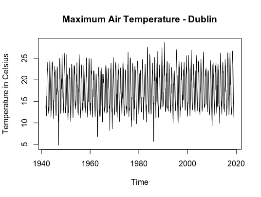

## SARIMA Background

The purpose of ARIMA is to determine the nature of the relationship between our residuals, which would provide our model with a certain degree of forecasting power. In the first instance, in order to conduct a time series analysis we must express our dataset in terms of logarithms. If our data is expressed solely in price terms, then this does not allow for continuous compounding of returns over time and will give misleading results.

An ARIMA model consists of coordinates (p, d, q):

- p stands for the number of autoregressive terms, i.e. the number of observations from past time values used to forecast future values. e.g. if the value of p is 2, then this means that two previous time observations in the series are being used to forecast the future trend.
- d denotes the number of differences needed to make the time series stationary (i.e. one with a constant mean, variance, and autocorrelation). For instance, if d = 1, then it means that a first-difference of the series must be obtained to transform it into a stationary one.
- q represents the moving average of the previous forecast errors in our model, or the lagged values of the error term. As an example, if q has a value of 1, then this means that we have one lagged value of the error term in the model.

## Seasonality

Seasonality is a significant concern when it comes to modelling time series. Seasonality is a particularly endemic feature of weather data – hence why many parts of the world have four seasons!

When seasonality is not accounted for, one risks erroneous forecasts of the data. While one could forecast a mean value for a particular time series, the peaks and valleys around that mean affect the forecasts for that time series significantly.

For instance, the mean maximum recorded temperature in Dublin, Ireland for the year 2018 was 18.9°C. However, with a low of 11.9°C and a high of 26.7°C, the dispersion around this mean is significant and influenced by seasonality.

For instance, let’s take a look at ARIMA forecasts for maximum temperature both with and without seasonal components:
Seasonal ARIMA


Non-seasonal ARIMA

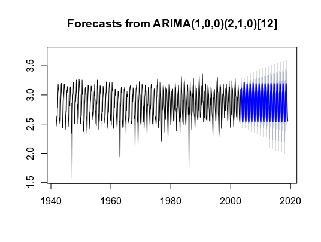

In these instances, we can see that the non-seasonal ARIMA forecast shows a much wider dispersion and makes it more unlikely that the maximum temperature for each month will be forecasted accurately.

In this regard, ARIMA needs to be modified in order to include a seasonal component.

ARIMA(p, d, q) × (P, D, Q)S

with p = non-seasonal AR order, d = non-seasonal differencing, q = non-seasonal MA order, P = seasonal AR order, D = seasonal differencing, Q = seasonal MA order, and S = time span of repeating seasonal pattern.
Seasonal ARIMA Analysis with R

Using the aforementioned data, the following procedures are carried out in R:

    The time series is converted into logarithmic format in order to smooth the volatility in the series.
    Autocorrelation and Partial Autocorrelation (ACF and PACF) plots are generated to detect the presence of stationarity, and a Dickey-Fuller test is conducted to validate the same.
    The time series is decomposed in order to examine the seasonal trend in isolation.
    auto.arima is then used to examine the best ARIMA configuration for the training data (the first 80% of all temperature data).
    The predicted values are then compared to the test values (the latter 20% of the data) to determine the model accuracy.
    Finally, the Ljung-Box test is used to determine if the data is independently distributed or exhibits serial correlation.

```
> # Directories
> setwd("directory")
> mydata<- read.csv("mly532.csv")
> attach(mydata)
The following objects are masked from mydata (pos = 4):

    date, maxtp

The following objects are masked from mydata (pos = 8):

    date, maxtp

The following objects are masked from mydata (pos = 9):

    date, maxtp

The following objects are masked from mydata (pos = 14):

    date, maxtp

> 
> # Load libraries
> library(MASS)
> library(tseries)
> library(forecast)
> 
> # Plot and convert to ln format
> lnweather=log(mydata$maxtp[1:741])
> lnweather
  [1] 2.639057 2.541602 2.476538 2.451005 2.785011 2.785011
  [7] 3.039749 3.182212 3.100092 3.104587 3.049273 2.944439
........
[733] 2.766319 2.595255 2.541602 2.509599 2.681022 2.912351
[739] 3.095578 3.034953 3.173878
> 
> # ACF, PACF and Dickey-Fuller Test
> acf(lnweather, lag.max=20)
> pacf(lnweather, lag.max=20)
> adf.test(lnweather)

	Augmented Dickey-Fuller Test

data:  lnweather
Dickey-Fuller = -9.2629, Lag order = 9, p-value = 0.01
alternative hypothesis: stationary

Warning message:
In adf.test(lnweather) : p-value smaller than printed p-value

> # Time series and seasonality
> weatherarima <- ts(lnweather, start = c(1941,11), frequency = 12)
> plot(weatherarima,type="l")
> title("Maximum Air Temperature - Dublin")
```

Here are the ACF and PACF plots:

ACF


PACF

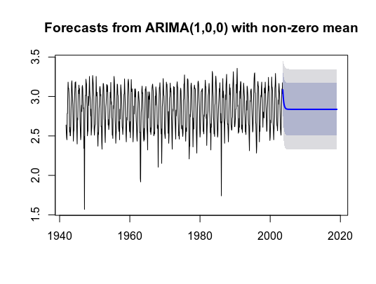

Now, the time series is defined and the components are analysed:

```
> # Time series and seasonality
> weatherarima <- ts(lnweather, start = c(1941,11), frequency = 12)
> plot(weatherarima,type="l")
> title("Maximum Air Temperature - Dublin")
> components <- decompose(weatherarima)
> components
$x
          Jan      Feb      Mar      Apr      May      Jun
1941                                                      
1942 2.476538 2.451005 2.785011 2.785011 3.039749 3.182212
1943 2.501436 2.501436 2.595255 2.833213 2.949688 3.169686
.....
2002 2.624669 2.564949 2.694627 2.954910 2.901422 3.072693
2003 2.541602 2.509599 2.681022 2.912351 3.095578 3.034953
          Jul      Aug      Sep      Oct      Nov      Dec
1941                                     2.639057 2.541602
1942 3.100092 3.104587 3.049273 2.944439 2.549445 2.610070
.....
2002 3.165475 3.086487 3.034953 2.928524 2.766319 2.595255
2003 3.173878                                             

$seasonal
             Jan         Feb         Mar         Apr         May
1941                                                            
1942 -0.31362491 -0.35898680 -0.15593894 -0.02671571  0.13670560
.....
2002 -0.31362491 -0.35898680 -0.15593894 -0.02671571  0.13670560
2003 -0.31362491 -0.35898680 -0.15593894 -0.02671571  0.13670560
             Jun         Jul         Aug         Sep         Oct
1941                                                            
1942  0.27355305  0.31190154  0.28790588  0.21125359  0.04673145
.....
2002  0.27355305  0.31190154  0.28790588  0.21125359  0.04673145
2003  0.27355305  0.31190154                                    
             Nov         Dec
1941 -0.14702167 -0.26576308
1942 -0.14702167 -0.26576308
.....
2002 -0.14702167 -0.26576308
2003                        

$trend
          Jan      Feb      Mar      Apr      May      Jun
1941                                                      
1942       NA       NA       NA       NA 2.837814 2.836933
1943 2.829826 2.832604 2.829045 2.824329 2.828174 2.827151
.....
2002 2.879646 2.870902 2.869069 2.868745 2.867848 2.867383
2003 2.863026       NA       NA       NA       NA       NA
          Jul      Aug      Sep      Oct      Nov      Dec
1941                                           NA       NA
1942 2.840823 2.843962 2.838157 2.832259 2.830515 2.826240
.....
2001 2.878778 2.885695 2.887395 2.898603 2.899514 2.888079
2002 2.862396 2.856628 2.853755 2.851415 2.857732 2.864249
2003       NA                                             

$random
               Jan           Feb           Mar           Apr
1941                                                        
1942            NA            NA            NA            NA
1943 -0.0147649865  0.0278182514 -0.0778510992  0.0356001029
.....
2002  0.0586479010  0.0530343061 -0.0185033055  0.1128809535
2003 -0.0077995720            NA            NA            NA
               May           Jun           Jul           Aug
1941                                                        
1942  0.0652292932  0.0717255328 -0.0526327312 -0.0272813565
.....
2002 -0.1031320807 -0.0682430232 -0.0088222488 -0.0580476292
2003            NA            NA            NA              
               Sep           Oct           Nov           Dec
1941                                        NA            NA
1942 -0.0001374702  0.0654487074 -0.1340478642  0.0495926311
.....
2002 -0.0300558356  0.0303770585  0.0556092504 -0.0032310605
2003                                                        

$figure
 [1] -0.14702167 -0.26576308 -0.31362491 -0.35898680 -0.15593894
 [6] -0.02671571  0.13670560  0.27355305  0.31190154  0.28790588
[11]  0.21125359  0.04673145

$type
[1] "additive"

attr(,"class")
[1] "decomposed.ts"
> plot(components)
```

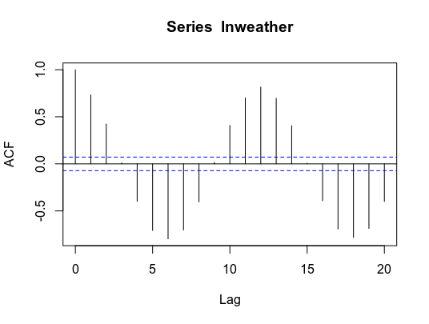

From the above, we see that there is a clear seasonal component present in the time series. As a result, it is highly likely that the ARIMA model will need a seasonal component attached.

To determine the ARIMA configuration, the auto.arima function in R is used.

```
> # ARIMA
> fitlnweather<-auto.arima(weatherarima, trace=TRUE, test="kpss", ic="bic")

 Fitting models using approximations to speed things up...

 ARIMA(2,0,2)(1,1,1)[12] with drift         : Inf
 ARIMA(0,0,0)(0,1,0)[12] with drift         : -611.7995
 ARIMA(1,0,0)(1,1,0)[12] with drift         : -780.1806
 ARIMA(0,0,1)(0,1,1)[12] with drift         : Inf
 ARIMA(0,0,0)(0,1,0)[12]                    : -618.3871
 ARIMA(1,0,0)(0,1,0)[12] with drift         : -619.4661
 ARIMA(1,0,0)(2,1,0)[12] with drift         : -853.9414
 ARIMA(1,0,0)(2,1,1)[12] with drift         : -997.1002
 ARIMA(0,0,0)(2,1,1)[12] with drift         : -981.0562
 ARIMA(2,0,0)(2,1,1)[12] with drift         : -995.0903
 ARIMA(1,0,1)(2,1,1)[12] with drift         : -992.372
 ARIMA(2,0,1)(2,1,1)[12] with drift         : -989.1888
 ARIMA(1,0,0)(2,1,1)[12]                    : -1003.538
 ARIMA(1,0,0)(1,1,1)[12]                    : Inf
 ARIMA(1,0,0)(2,1,0)[12]                    : -860.5261
 ARIMA(1,0,0)(2,1,2)[12]                    : Inf
 ARIMA(1,0,0)(1,1,0)[12]                    : -786.7557
 ARIMA(0,0,0)(2,1,1)[12]                    : -987.4968
 ARIMA(2,0,0)(2,1,1)[12]                    : -1001.63
 ARIMA(1,0,1)(2,1,1)[12]                    : -998.8159
 ARIMA(2,0,1)(2,1,1)[12]                    : -995.6974

 Now re-fitting the best model(s) without approximations...

 ARIMA(1,0,0)(2,1,1)[12]                    : Inf
 ARIMA(2,0,0)(2,1,1)[12]                    : Inf
 ARIMA(1,0,1)(2,1,1)[12]                    : Inf
 ARIMA(1,0,0)(2,1,1)[12] with drift         : Inf
 ARIMA(2,0,1)(2,1,1)[12]                    : Inf
 ARIMA(2,0,0)(2,1,1)[12] with drift         : Inf
 ARIMA(1,0,1)(2,1,1)[12] with drift         : Inf
 ARIMA(2,0,1)(2,1,1)[12] with drift         : Inf
 ARIMA(0,0,0)(2,1,1)[12]                    : Inf
 ARIMA(0,0,0)(2,1,1)[12] with drift         : Inf
 ARIMA(1,0,0)(2,1,0)[12]                    : -912.3429

 Best model: ARIMA(1,0,0)(2,1,0)[12]                    

> fitlnweather
Series: weatherarima 
ARIMA(1,0,0)(2,1,0)[12] 

Coefficients:
         ar1     sar1     sar2
      0.1729  -0.6074  -0.3256
s.e.  0.0366   0.0349   0.0349

sigma^2 estimated as 0.0161:  log likelihood=469.35
AIC=-930.71   AICc=-930.65   BIC=-912.34
> confint(fitlnweather)
          2.5 %     97.5 %
ar1   0.1011967  0.2445152
sar1 -0.6757577 -0.5391002
sar2 -0.3940417 -0.2572564
> plot(weatherarima,type='l')
> title('Maximum Air Temperature - Dublin')
> exp(lnweather)
  [1] 14.0 12.7 11.9 11.6 16.2 16.2 20.9 24.1 22.2 22.3 21.1 19.0
 [13] 12.8 13.6 12.2 12.2 13.4 17.0 19.1 23.8 24.5 21.6 20.0 17.9
.....
[721] 15.5 13.9 13.8 13.0 14.8 19.2 18.2 21.6 23.7 21.9 20.8 18.7
[733] 15.9 13.4 12.7 12.3 14.6 18.4 22.1 20.8 23.9
```

From the above, the best identified configuration on the basis of BIC is:

```
ARIMA(1,0,0)(2,1,0)[12]
```

Now that the configuration has been selected, the forecasts can be made. With the size of the test data being 186 observations, 186 forecasts are run accordingly.

```
> # Forecasted Values From ARIMA
> forecastedvalues_ln=forecast(fitlnweather,h=186)
> forecastedvalues_ln
         Point Forecast    Lo 80    Hi 80    Lo 95    Hi 95
Aug 2003       3.116195 2.953592 3.278799 2.867515 3.364876
Sep 2003       3.034242 2.869227 3.199257 2.781873 3.286610
.....
Dec 2018       2.605504 2.240256 2.970751 2.046906 3.164102
Jan 2019       2.552441 2.187193 2.917688 1.993843 3.111039
> plot(forecastedvalues_ln)
```

As previously plotted above, here is a visual representation of the forecast:

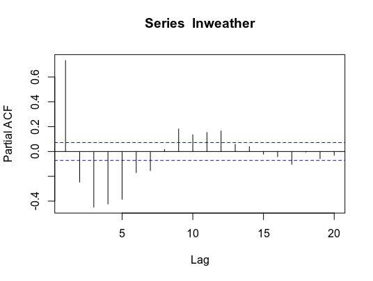

Now, the data needs to be converted back into its original format by calculating the exponent of the log predictions. These predictions are then compared against the test data to identify:

    The percentage differences between the predictions and the actual data.
    The number of predictions with a percentage difference of lower than 10% from the actual.

```
> forecastedvaluesextracted=as.numeric(forecastedvalues_ln$mean)
> finalforecastvalues=exp(forecastedvaluesextracted)
> finalforecastvalues
  [1] 22.56038 20.78521 18.74774 15.18035 13.50602 12.62281
  [7] 12.75235 14.49071 17.57334 20.95419 21.81393 24.77953
 .....
[175] 12.64930 14.57672 18.09685 20.80818 21.45437 24.31657
[181] 22.55312 20.65543 18.87354 15.45700 13.53804 12.83840
```

Now that the forecasted values have been calculated, we can compare this against the test data to forecast the percentage error:

```
> # Percentage Error
> df<-data.frame(mydata$maxtp[742:927],finalforecastvalues)
> col_headings<-c("Actual Weather","Forecasted Weather")
> names(df)<-col_headings
> attach(df)
The following objects are masked from df (pos = 4):

    Actual Weather, Forecasted Weather

The following objects are masked from df (pos = 6):

    Actual Weather, Forecasted Weather

The following objects are masked from df (pos = 7):

    Actual Weather, Forecasted Weather

The following objects are masked from df (pos = 8):

    Actual Weather, Forecasted Weather

The following objects are masked from df (pos = 11):

    Actual Weather, Forecasted Weather

> percentage_error=((df$`Actual Weather`-df$`Forecasted Weather`)/(df$`Actual Weather`))
> percentage_error
  [1]  0.1221641965  0.1550726506  0.0027798558  0.0269008361
  [5]  0.0141587687  0.0138431605  0.1383544854  0.1270658764
.....
[181]  0.1014693353  0.1019379867  0.0170029142 -0.0102615539
[185] -0.0103016944 -0.1361414900
> mean(percentage_error)
[1] -0.00337078
> percentage_error=data.frame(abs(percentage_error))
> accuracy=data.frame(percentage_error[percentage_error$abs.percentage_error. < 0.1,])
> frequency=as.data.frame(table(accuracy))
> sum(frequency$Freq)/186
[1] 0.7043011
```

From the above:

    The mean percentage error (or average of all percentage errors) is -0.3%.
    The number of predictions with a percentage error below 10% relative to the actual is over 70%.

In the context of weather data, having 70% of predictions within 10% of the actual value implies good performance. For instance, the difference between 14°C and 15°C is just over 7%, meaning that a 10% difference would imply a 1°C-2°C difference between the forecasted and actual values.

By plotting a histogram, we can see that a large majority of the forecasts are within 20% of the actual temperature values:

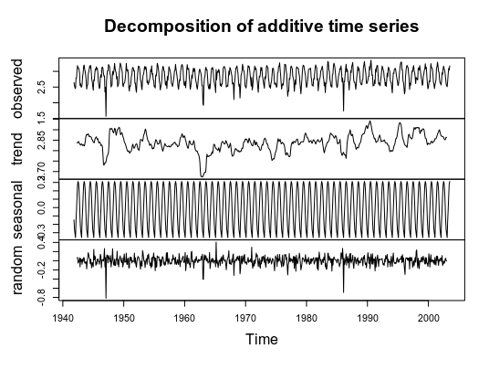

Finally, a Ljung-Box test is conducted. Essentially, the test is being used to determine if the residuals of our time series follow a random pattern, or if there is a significant degree of non-randomness.

H0: Residuals follow a random pattern
HA: Residuals do not follow a random pattern

Note that the method for choosing a specific number of lags for Ljung-Box can be quite arbitrary. In this regard, we will run the Ljung-Box test with lags 5, 10, and 15. To run this test in R, we use the following functions:

```
> # Ljung-Box
> Box.test(fitlnweather$resid, lag=5, type="Ljung-Box")

	Box-Ljung test

data:  fitlnweather$resid
X-squared = 5.5705, df = 5, p-value = 0.3503

> Box.test(fitlnweather$resid, lag=10, type="Ljung-Box")

	Box-Ljung test

data:  fitlnweather$resid
X-squared = 10.863, df = 10, p-value = 0.3683

> Box.test(fitlnweather$resid, lag=15, type="Ljung-Box")

	Box-Ljung test

data:  fitlnweather$resid
X-squared = 16.736, df = 15, p-value = 0.3349
```

We see that across lags 5, 10, and 15, the null hypothesis that the lags follow a random pattern cannot be rejected and therefore our ARIMA model is free of autocorrelation.
Seasonal ARIMA Analysis with Python

Now, a similar analysis will be conducted on the data in Python.

In particular, the pyramid library will be used in a similar manner to auto.arima in R to determine the best model configuration.

Firstly, let’s generate a heatmap using seaborn for the most recent four years of data to determine the maximum temperature dispersion by month:

```
import matplotlib.pyplot as plt
import numpy as np
import pandas as pd
import seaborn as sns
sns.set()
import os;
path="directory"
os.chdir(path)
os.getcwd()

#Variables
dataset=pd.read_csv("mly532 month.csv")
weather = dataset.pivot("month", "year", "maxtp")
sns.heatmap(weather, annot=True, cmap="coolwarm")
plt.title("Maximum Air Temperature: Dublin, Ireland")
plt.show()
```

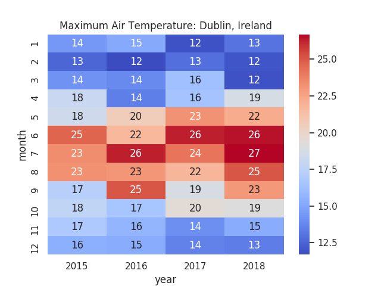

Again, we see significant dispersion in the maximum temperature across months.
Now, the relevant data processing is conducted and the time series is decomposed into its elements:

```
# Import Libraries
import csv
import math
import matplotlib.mlab as mlab
import matplotlib.pyplot as plt
import numpy as np
import os
import pandas as pd
import psycopg2
import pyramid
import random
import seaborn as sns
import statsmodels.tsa.stattools as ts
from pyramid.arima import auto_arima
from statsmodels.tsa.stattools import acf, pacf
from statsmodels.tsa.arima_model import ARIMA
from statsmodels.tsa.seasonal import seasonal_decompose

import os;
path="directory"
os.chdir(path)
os.getcwd()

from pandas import Series
from matplotlib import pyplot
series = Series.from_csv('mly532.csv', header=0)
series = np.log(series)
series.plot()
plt.xlabel('Year')
plt.ylabel('Maximum Temperature')
plt.title('Maximum Air Temperature in Dublin, Ireland')
pyplot.show()
```

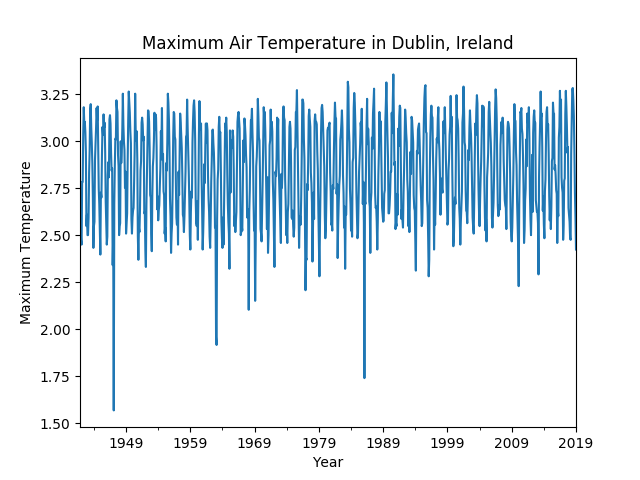

```
decomposition=seasonal_decompose(series, model='multiplicative')
trend=decomposition.trend
seasonal=decomposition.seasonal
residual=decomposition.resid
plt.subplot(221)
plt.plot(series,color='#ff0000', label='Series')
plt.legend(loc='best')
plt.subplot(222)
plt.plot(trend,color='#1100ff', label='Trend')
plt.legend(loc='best')
plt.tight_layout()
plt.subplot(223)
plt.plot(residual,color='#00ff1a', label='Residual')
plt.legend(loc='best')
plt.tight_layout()
plt.subplot(224)
plt.plot(seasonal,color='#de00ff', label='Seasonality')
plt.legend(loc='best')
plt.tight_layout()
plt.show()
```

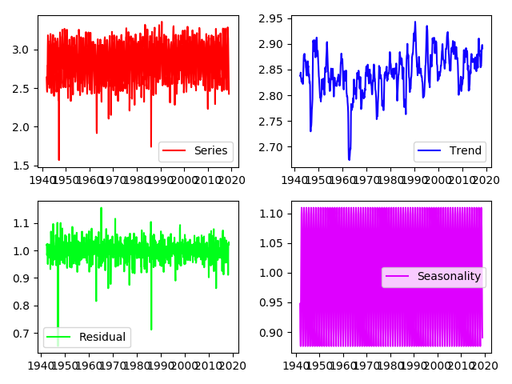

```
from pyramid.arima.stationarity import ADFTest
adf_test = ADFTest(alpha=0.05)
adf_test.is_stationary(series)
train, test = series[1:741], series[742:927]
train.shape
test.shape
plt.plot(train)
plt.plot(test)
plt.title("Training and Test Data")
plt.show()
```

SARIMA

Now, the ARIMA model is generated with pyramid in order to identify the best configuration:

```
>>> Arima_model=auto_arima(train, start_p=1, start_q=1, max_p=8, max_q=8, start_P=0, start_Q=0, max_P=8, max_Q=8, m=12, seasonal=True, trace=True, d=1, D=1, error_action='warn', suppress_warnings=True, random_state = 20, n_fits=30)
Fit ARIMA: order=(1, 1, 1) seasonal_order=(0, 1, 0, 12); AIC=-667.202, BIC=-648.847, Fit time=3.710 seconds
Fit ARIMA: order=(0, 1, 0) seasonal_order=(0, 1, 0, 12); AIC=-270.700, BIC=-261.522, Fit time=0.354 seconds
Fit ARIMA: order=(1, 1, 0) seasonal_order=(1, 1, 0, 12); AIC=-625.446, BIC=-607.090, Fit time=2.365 seconds
Fit ARIMA: order=(0, 1, 1) seasonal_order=(0, 1, 1, 12); AIC=-1090.370, BIC=-1072.014, Fit time=7.584 seconds
Fit ARIMA: order=(0, 1, 1) seasonal_order=(1, 1, 1, 12); AIC=-1088.657, BIC=-1065.712, Fit time=10.024 seconds
Fit ARIMA: order=(0, 1, 1) seasonal_order=(0, 1, 0, 12); AIC=-653.939, BIC=-640.172, Fit time=1.733 seconds
Fit ARIMA: order=(0, 1, 1) seasonal_order=(0, 1, 2, 12); AIC=-1087.889, BIC=-1064.944, Fit time=25.853 seconds
Fit ARIMA: order=(0, 1, 1) seasonal_order=(1, 1, 2, 12); AIC=-1087.188, BIC=-1059.655, Fit time=31.205 seconds
Fit ARIMA: order=(1, 1, 1) seasonal_order=(0, 1, 1, 12); AIC=-1105.233, BIC=-1082.288, Fit time=10.266 seconds
Fit ARIMA: order=(1, 1, 0) seasonal_order=(0, 1, 1, 12); AIC=-887.349, BIC=-868.994, Fit time=9.558 seconds
Fit ARIMA: order=(1, 1, 2) seasonal_order=(0, 1, 1, 12); AIC=-1086.931, BIC=-1059.397, Fit time=11.649 seconds
Fit ARIMA: order=(0, 1, 0) seasonal_order=(0, 1, 1, 12); AIC=-724.814, BIC=-711.047, Fit time=4.372 seconds
Fit ARIMA: order=(2, 1, 2) seasonal_order=(0, 1, 1, 12); AIC=-1085.480, BIC=-1053.358, Fit time=17.619 seconds
Fit ARIMA: order=(1, 1, 1) seasonal_order=(1, 1, 1, 12); AIC=-1072.933, BIC=-1045.400, Fit time=13.924 seconds
Fit ARIMA: order=(1, 1, 1) seasonal_order=(0, 1, 2, 12); AIC=-1102.926, BIC=-1075.392, Fit time=28.082 seconds
Fit ARIMA: order=(1, 1, 1) seasonal_order=(1, 1, 2, 12); AIC=-1102.342, BIC=-1070.219, Fit time=35.426 seconds
Fit ARIMA: order=(2, 1, 1) seasonal_order=(0, 1, 1, 12); AIC=-1010.837, BIC=-983.303, Fit time=8.926 seconds
Total fit time: 222.656 seconds
>>> 
>>> Arima_model.summary()
<class 'statsmodels.iolib.summary.Summary'>
"""
                                 Statespace Model Results                                 
==========================================================================================
Dep. Variable:                                  y   No. Observations:                  740
Model:             SARIMAX(1, 1, 1)x(0, 1, 1, 12)   Log Likelihood                 557.617
Date:                            Thu, 14 Mar 2019   AIC                          -1105.233
Time:                                    16:33:59   BIC                          -1082.288
Sample:                                         0   HQIC                         -1096.379
                                            - 740                                         
Covariance Type:                              opg                                         
==============================================================================
                 coef    std err          z      P>|z|      [0.025      0.975]
------------------------------------------------------------------------------
intercept   1.359e-06   6.75e-06      0.201      0.840   -1.19e-05    1.46e-05
ar.L1          0.1558      0.034      4.575      0.000       0.089       0.223
ma.L1         -0.9847      0.013    -75.250      0.000      -1.010      -0.959
ma.S.L12      -0.9933      0.092    -10.837      0.000      -1.173      -0.814
sigma2         0.0118      0.001     11.259      0.000       0.010       0.014
===================================================================================
Ljung-Box (Q):                       54.38   Jarque-Bera (JB):              3179.66
Prob(Q):                              0.06   Prob(JB):                         0.00
Heteroskedasticity (H):               0.77   Skew:                            -1.46
Prob(H) (two-sided):                  0.04   Kurtosis:                        12.82
===================================================================================

Warnings:
[1] Covariance matrix calculated using the outer product of gradients (complex-step).
```

Now, a prediction can be made with the model for the next 185 periods, with the prediction data compared to the test data in a similar way as done with R.

```
>>> prediction=pd.DataFrame(Arima_model.predict(n_periods=185), index=test.index)
>>> prediction.columns = ['Predicted_Temperature']
>>> plt.figure(figsize=(15,10))
<Figure size 1500x1000 with 0 Axes>
>>> plt.plot(train, label='Training')
[<matplotlib.lines.Line2D object at 0x7fbd668fa908>]
>>> plt.plot(test, label='Test')
[<matplotlib.lines.Line2D object at 0x7fbd6e8871d0>]
>>> plt.plot(prediction, label='Predicted')
[<matplotlib.lines.Line2D object at 0x7fbd6e87a5c0>]
>>> plt.legend(loc = 'upper center')
<matplotlib.legend.Legend object at 0x7fbd6e887320>
>>> plt.show()
```

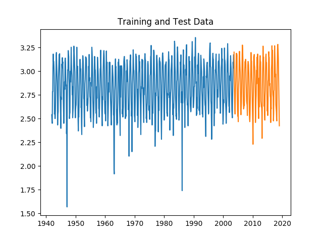

```
>>> predictions=prediction['Predicted_Temperature']
>>> predictions=np.exp(predictions)
>>> test=np.exp(test)
>>> mse=(predictions-test)/test
>>> np.mean(mse)
0.0284017024807253
>>> mse=abs(mse)
>>> below10=mse[mse < 0.10].count()
>>> all=mse.count()
>>> accuracy=below10/all
>>> accuracy
0.4
```
However, note that in this instance, the accuracy came in at 40% (i.e. 40% of the predictions were within 10% accuracy of the actual), whereas the accuracy of the ARIMA model in R was over 70%.

Note that the SARIMA model generated in this instance was of a different configuration to that generated in R.

Model configuration indicated in Python

```
SARIMAX(1, 1, 1)x(0, 1, 1, 12)
```

Model configuration indicated in R

```
SARIMAX(1, 0, 0)x(2, 1, 0, 12)
```

In this regard, it would appear that R did a better job than Python in identifying the correct configuration.

To validate this, the anlaysis is re-run again in Python, using the same ARIMA configuration generated in R.

Here is the analysis:

```
>>> # Import Libraries
>>> import csv
>>> import math
>>> import matplotlib.mlab as mlab
>>> import matplotlib.pyplot as plt
>>> import numpy as np
>>> import os
>>> import pandas as pd
>>> import psycopg2
>>> import pyramid
>>> import random
>>> import seaborn as sns
>>> import statsmodels.tsa.stattools as ts
>>> from pyramid.arima import auto_arima
>>> from statsmodels.tsa.stattools import acf, pacf
>>> from statsmodels.tsa.arima_model import ARIMA
>>> from statsmodels.tsa.seasonal import seasonal_decompose
>>> import os;

>>> path="directory"
>>> os.chdir(path)
>>> os.getcwd()
'directory'
>>> from pandas import Series
>>> from matplotlib import pyplot

>>> series = Series.from_csv('mly532.csv', header=0)
>>> series = np.log(series)
>>> import statsmodels.api as sm  
>>> from statsmodels.tsa.stattools import acf  
>>> from statsmodels.tsa.stattools import pacf
>>> from statsmodels.tsa.seasonal import seasonal_decompose
>>> train, test = series[1:741], series[742:927]
>>> train.shape
(740,)
>>> test.shape
(185,)
>>>model=sm.tsa.statespace.SARIMAX(endog=train,order=(1,0,0),seasonal_order=(2,1,0,12),trend='c',enforce_invertibility=False)
>>> results=model.fit()
RUNNING THE L-BFGS-B CODE

           * * *

Machine precision = 2.220D-16
 N =            5     M =           10
 This problem is unconstrained.

At X0         0 variables are exactly at the bounds

At iterate    0    f= -6.04613D-01    |proj g|=  1.94201D+00

At iterate    5    f= -6.32287D-01    |proj g|=  2.78073D-02

At iterate   10    f= -6.32698D-01    |proj g|=  5.14999D-02

At iterate   15    f= -6.32724D-01    |proj g|=  6.92106D-03

At iterate   20    f= -6.32727D-01    |proj g|=  4.46934D-05

           * * *

Tit   = total number of iterations
Tnf   = total number of function evaluations
Tnint = total number of segments explored during Cauchy searches
Skip  = number of BFGS updates skipped
Nact  = number of active bounds at final generalized Cauchy point
Projg = norm of the final projected gradient
F     = final function value

           * * *

   N    Tit     Tnf  Tnint  Skip  Nact     Projg        F
    5     21     31      1     0     0   4.272D-05  -6.327D-01
  F = -0.63272714659115192     

CONVERGENCE: REL_REDUCTION_OF_F_<=_FACTR*EPSMCH             

 Cauchy                time 0.000E+00 seconds.
 Subspace minimization time 0.000E+00 seconds.
 Line search           time 0.000E+00 seconds.

 Total User time 0.000E+00 seconds.

>>> print(results.summary())
                                 Statespace Model Results                                 
==========================================================================================
Dep. Variable:                              maxtp   No. Observations:                  740
Model:             SARIMAX(1, 0, 0)x(2, 1, 0, 12)   Log Likelihood                 468.218
Date:                            Thu, 14 Mar 2019   AIC                           -926.436
Time:                                    16:54:47   BIC                           -903.485
Sample:                                12-01-1941   HQIC                          -917.580
                                     - 07-01-2003                                         
Covariance Type:                              opg                                         
==============================================================================
                 coef    std err          z      P>|z|      [0.025      0.975]
------------------------------------------------------------------------------
intercept      0.0006      0.005      0.126      0.900      -0.009       0.011
ar.L1          0.1728      0.032      5.469      0.000       0.111       0.235
ar.S.L12      -0.6074      0.023    -26.858      0.000      -0.652      -0.563
ar.S.L24      -0.3256      0.023    -14.108      0.000      -0.371      -0.280
sigma2         0.0161      0.000     39.691      0.000       0.015       0.017
===================================================================================
Ljung-Box (Q):                      129.08   Jarque-Bera (JB):              2081.35
Prob(Q):                              0.00   Prob(JB):                         0.00
Heteroskedasticity (H):               0.76   Skew:                            -0.97
Prob(H) (two-sided):                  0.04   Kurtosis:                        11.05
===================================================================================

Warnings:
[1] Covariance matrix calculated using the outer product of gradients (complex-step).

>>> predictions=results.predict(741, 925, typ='levels')
>>> predictions=np.exp(predictions)
>>> test=np.exp(test)
>>> mse=(predictions-test)/test
>>> mse=abs(mse)
>>> below10=mse[mse < 0.10].count()
>>> all=mse.count()
>>> accuracy=below10/all
>>> accuracy
0.7081081081081081
```

It is observed that the updated configuration has raised the reported accuracy to over 70%, indicating that modifying the ARIMA model resulted in a significant improvement.

Again, a histogram illustrates that the majority of forecast errors lie below 20%:

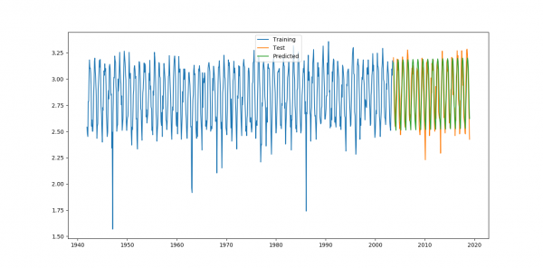

Conclusion

In this example, we have seen:

    How to generate ARIMA models in Python and R
    Importance in accounting for seasonality trends and methods to accomplish this
    How to select the correct ARIMA modification and validate results
